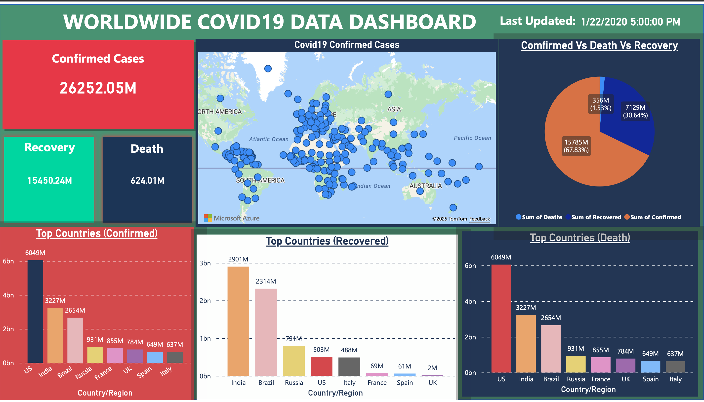

# **Worldwide COVID-19 Data Dashboard (Power BI Visualization Project)**

This project is an interactive **Power BI dashboard** that analyzes the global impact of COVID-19 using confirmed cases, recoveries, and deaths across all affected countries.
The dashboard provides high-level insights, country comparisons, and trend analysis to help users understand how COVID-19 spread and which regions were most affected.

This visualization is built entirely in **Power BI Web**, using cleaned data from Kaggle.

# **Dashboard Preview**

# **Dashboard Features**

## **1. Global Summary (KPI Cards)**

The dashboard includes top-level global COVID-19 statistics:

* **Total Confirmed Cases**
* **Total Recoveries**
* **Total Deaths**
* **Last Updated Date**

These KPIs provide a quick snapshot of the worldwide situation.

## **2. Top Countries Analysis**

The dashboard shows the most affected countries using ranked bar charts:

### 📌 **Top Countries by Confirmed Cases**

### 📌 **Top Countries by Recoveries**

### 📌 **Top Countries by Deaths**

This helps compare how countries were impacted differently.

## **3. Case Distribution Overview**

A breakdown of total confirmed cases into:

* **Recovered (%)**
* **Deaths (%)**
* **Active/Remaining (%)**

Displayed using an intuitive **pie chart**, showing the overall outcome of global COVID-19 cases.

## **4. Global Trend (Time Series)**

A **line chart** illustrating how **confirmed cases** increased globally over time.

This visual makes it easy to see:

* Peaks
* Waves of infection
* Growth trends

## **5. Interactive World Map**

A geographic heat-map built using **Azure Maps** showing the spread of COVID-19 across countries.

Users can hover over countries to view confirmed case counts.

# **Dataset**

The data used for this dashboard was sourced from Kaggle:

* **Dataset Name:** COVID-19 Global Dataset (Confirmed, Deaths, Recovered)
* **Data Columns Used:**

  * Confirmed
  * Deaths
  * Recovered
  * Country/Region
  * ObservationDate

The dataset includes cumulative daily case updates for multiple countries, enabling accurate trend analysis.

# **Tools & Technologies Used**

* **Power BI Web**
* **Power Query (Data Cleaning)**
* **Azure Maps Visual**
* **Bar Charts, Line Charts, Pie Charts, Cards**
* **Date Hierarchy and Filters**

# **Data Cleaning & Transformation**

Cleaning performed in Power Query included:

* Standardizing column names
* Removing null or empty rows
* Ensuring numeric columns were correctly typed
* Grouping by country (where needed)
* Creating additional calculated fields like:

  * *Recovery Percentage*
  * *Death Percentage*

# **Insights from the Dashboard**

Here are some key observations from the visualization:

* The **US**, **India**, and **Brazil** report the highest confirmed cases.
* India shows a strong recovery count, ranking highest in total recoveries.
* Despite global recovery rates being high, **millions of active and fatal cases** remain significant.
* The global case growth curve shows sharp surges during major COVID-19 waves.

# **Skills Demonstrated**

This project highlights:

* Data visualization & storytelling
* Analytical reasoning
* Power BI Web reporting
* Using maps for geographic insights
* Data cleaning with Power Query
* Dashboard layout design
* Real-world dataset handling (Kaggle)

# **How to Use This Dashboard**

1. Clone this repository
2. Upload or open the **PBIX file** (if using Desktop)
3. Or view the interactive version directly in Power BI Service (if link provided)

# **Author**

**Jasper Chinedu Nwangere**

**Email: sparobanks@gmail.com**

**[LinkedIn](https://www.linkedin.com/in/sparobanks/)**
